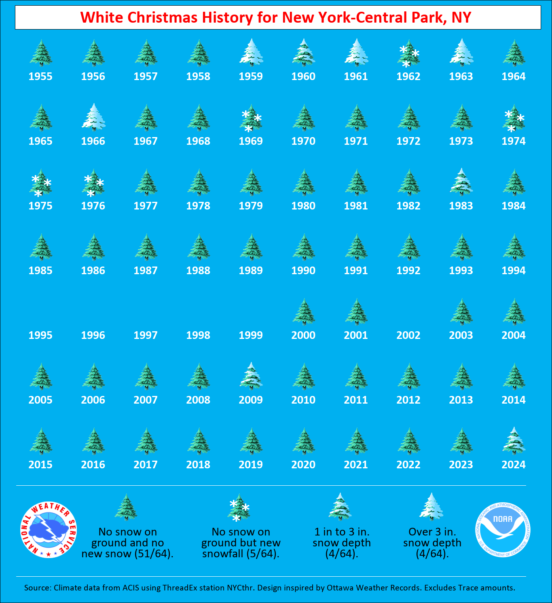

# I'm Dreaming of a White Christmas
## Written By Jared Rennie (@jjrennie)

Have you wondered if you got a White Christmas on a particular year? This notebook will help you answer that question. We will be using data from <a href='http://www.ncei.noaa.gov' target='_blank'> NOAA's National Centers of Environmental Information</a>, specifically the Global Historical Climatology Network - Daily Dataset: 

- GHCNd Info: https://www.ncei.noaa.gov/products/global-historical-climatology-network-daily
- GHCNd AWS Location: https://registry.opendata.aws/noaa-ghcn/

In addition to answering the question, you will learn how to get data from the cloud and plot it, without actually reading in the entire dataset!

### What's the Criteria Used?
We will use criteria defined by our National Weather Service Colleague <a href='https://bsky.app/profile/climatologist49.bsky.social' target='_blank'>Brian Brettschneider</a>:

- No snow on the ground but new snowflall.
- 1-3" of snow on the ground.
- More than 3" of snow on the ground.

### What You Need
First off, the entire codebase works in Python 3. In addition to base Python, you will need the following packages installed: 
- pandas (to slice annd dice the data)
- geopandas (to read in some shapefiles)
- pyarrow or fastparquet (for the parquet data ingest)
- matplotlib and cartopy (to plot)
  
The "easiest" way is to install these is by installing <a href='https://www.anaconda.com' target="_blank">anaconda</a>, and then applying <a href='https://conda-forge.org/' target="_blank">conda-forge</a>. Afterward, then you can install the above packages. 

